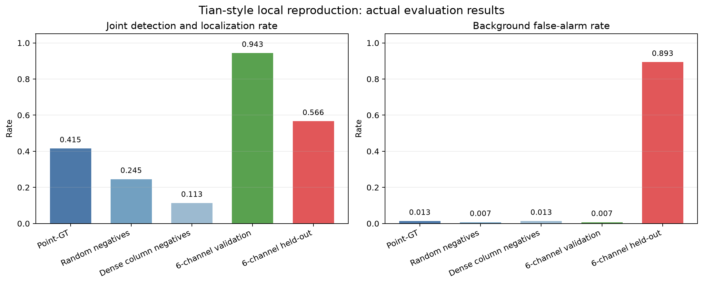
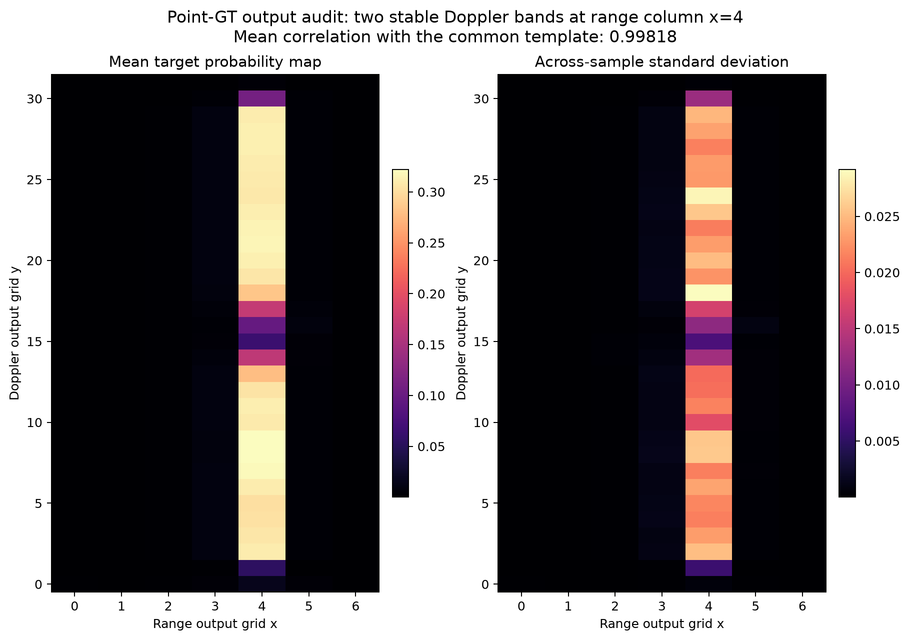
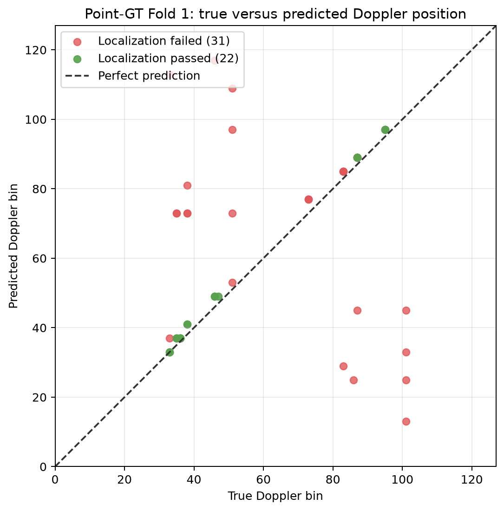
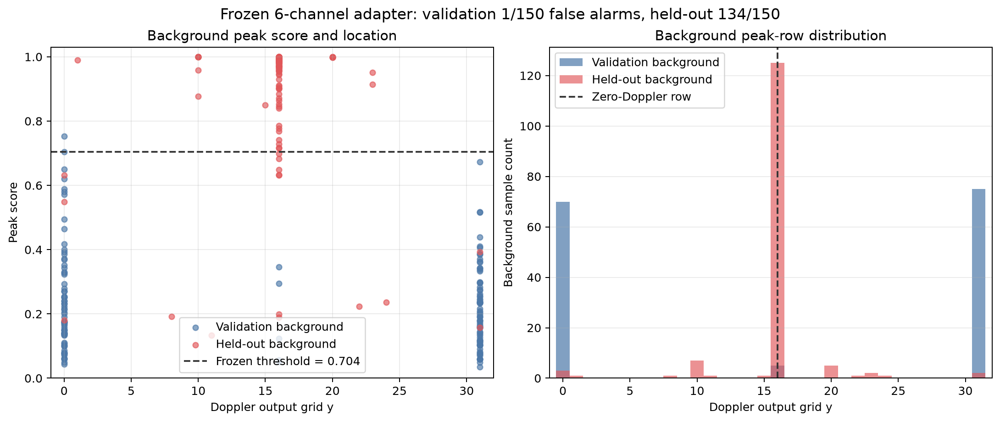

# 给学长看的实际复现结果

这份材料只展示已经运行出来的结果，不把诊断实验包装成成功复现。

## 1. 各次实验的结果对比

左图是“目标被检测到，而且位置也正确”的比例；右图是背景被误认为目标的比例。

- point-GT 正确检测并定位 `22/53=0.4151`，背景误报 `2/150=0.0133`。
- 加 16 个随机负样本后，正确率降到 `0.2453`。
- 加同距离列密集负样本后，正确率继续降到 `0.1132`。
- 六通道模型在验证背景上达到 `50/53=0.9434`，误报只有 `1/150`。
- 同一个六通道模型和同一个阈值换到另一批背景后，只有 `30/53=0.5660`，背景误报达到
  `134/150=0.8933`。

这说明简单增加负样本没有解决原模型的问题；六通道模型虽然在一批数据上效果好，但换背景后
没有保持住。

## 2. 原 Tian 风格模型实际学到的输出

左图是 53 张目标图的平均网络输出，右图是这些输出在不同样本之间的变化大小。可以看到高分
几乎全部集中在距离列 `x=4`，并形成上下两段固定速度带。

53 张目标输出和公共平均模板的相关系数均值为 `0.99818`。这个数越接近 1，表示不同样本的
输出越相似。因此模型主要记住了固定位置和速度范围，没有稳定地根据每张输入改变定位结果。

## 3. point-GT 的真实位置和预测位置

虚线表示预测位置完全正确。绿色点是通过定位容差的 22 个目标，红色点是定位失败的 31 个目标。
不少红点离虚线很远，说明网络虽然能判断“可能有目标”，但最后给出的速度位置仍可能严重偏离。

实际样本示例：

| 样本 | 真实 Doppler bin | 预测 Doppler bin | 结果 |
|---|---:|---:|---|
| `20260202_144458_beam1` | 33 | 33 | 定位通过 |
| `20260202_144458_beam2` | 33 | 33 | 定位通过 |
| `20260202_144629_beam3` | 101 | 13 | 相差 88 bins，定位失败 |
| `20260202_144458_beam5` | 33 | 113 | 相差 80 bins，定位失败 |
| `20260202_144629_beam1` | 101 | 25 | 相差 76 bins，定位失败 |

负责人本地受控目录中保存完整的 203 个验证样本结果；普通成员同步包只保留本节的聚合图和结论摘要。

## 4. 六通道模型为什么换背景后失效

左图中虚线是冻结阈值 `0.7037`。蓝点是验证背景，红点是后来一次冻结评价使用的背景。验证背景
大多在 Doppler 输出边缘，且分数低于阈值；新背景的峰大量集中在零多普勒行 `y=16`，并超过
冻结阈值。

右图进一步显示，两批背景的峰值位置分布明显不同：

- 验证背景只有 `1/150` 被误报；
- 新背景有 `134/150` 被误报；
- 新背景中有 `125/150` 个峰位于零多普勒行。

实际误报样本包括：

| 样本 | 峰值分数 | 峰值网格行 | 预测 Doppler bin |
|---|---:|---:|---:|
| `20260204_100739_beam1_az001` | 0.9775 | 16 | 64 |
| `20260204_100739_beam1_az010` | 0.9293 | 16 | 64 |
| `20260204_100739_beam1_az019` | 0.9943 | 16 | 64 |
| `20260204_100739_beam1_az028` | 0.9020 | 16 | 64 |
| `20260204_100739_beam1_az037` | 0.9995 | 16 | 64 |

负责人本地受控目录中的完整预测位于：

- `evidence/thesis_adapter_validation_predictions.csv`
- `evidence/thesis_adapter_heldout_predictions.csv`

## 5. 学长看完这些结果应该得到的结论

> 我们确实完成了模型训练并得到了实际输出，不是因为程序无法运行而停止。原 Tian 风格模型
> 在本地数据上学成了固定速度模板；point-GT 只能部分改善定位；六通道改造解决了固定模板，
> 但在另一批背景上出现严重误报。因此当前已经证明的是“本地迁移和跨背景泛化没有通过”，
> 还不能证明论文作者的方法在原数据上无效。

## 6. 图和数据的对应关系

| 图 | 数据来源 |
|---|---|
| `01_experiment_outcomes.png` | 四份诊断配置、adapter validation/held-out summary |
| `02_fixed_template_heatmap.png` | `point_gt_target_probability_mean_map.csv` 和 `point_gt_target_probability_std_map.csv` |
| `03_point_gt_velocity_localization.png` | 负责人本地的 point-GT 预测表 |
| `04_background_group_shift.png` | 负责人本地的两份 adapter 背景预测表 |

图可以使用同目录下的 `generate_figures.py` 从包内证据重新生成。
