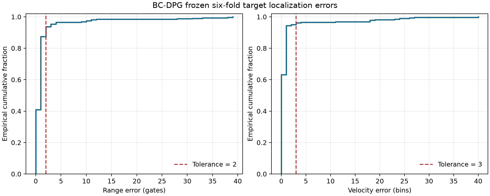

# BC-DPG frozen localization evidence

## Scope

This report aggregates the frozen base-threshold test predictions from the six complete-scan BC-DPG folds. It performs no training, inference, threshold selection, or test-set retuning. BC-DPG changes only candidate scores, so raw DPG and calibrated BC-DPG share the same predicted range-velocity coordinates.

## Main result

Among 318 target samples, 302 pass the frozen score thresholds, 297 satisfy the localization tolerance regardless of score, and 289 satisfy both conditions. The pooled score Pd is 0.9497, localization-ok rate is 0.9340, and joint Pd is 0.9088. Among score-detected targets, 0.9570 meet the localization tolerance.

The decomposition is 289 detected and localized, 13 detected but outside tolerance, 8 within localization tolerance but below threshold, and 8 satisfying neither.

## Error distribution

Across all targets, range error has MAE 1.418 gates, median 1.000, P90 2.000, and maximum 39. Velocity error has MAE 1.154 bins, median 0.000, P90 1.000, and maximum 40. The gap between P90 and the maximum shows a small catastrophic-error tail that MAE alone would obscure.

Conditioned on passing the frozen score threshold, range MAE is 1.189 gates and velocity MAE is 0.834 bins. Conditional metrics must be reported together with the unconditional and joint rates.

The grid-equivalent conversions use 30 m per range gate and 0.183 m/s per velocity bin. They describe discrete-grid offsets, not continuous physical measurement error relative to unquantized ground truth.

## Fold results

| fold | target_samples | score_pd | localization_ok_rate | joint_pd | range_gates_mae | velocity_bins_mae |
|---|---|---|---|---|---|---|
| 1 | 53 | 1.0000 | 1.0000 | 1.0000 | 0.4528 | 0.3208 |
| 2 | 53 | 1.0000 | 0.9245 | 0.9245 | 1.1321 | 1.3585 |
| 3 | 52 | 0.8654 | 0.9231 | 0.8654 | 1.0577 | 1.4231 |
| 4 | 52 | 1.0000 | 0.9038 | 0.9038 | 2.6731 | 1.9423 |
| 5 | 60 | 0.9833 | 0.9500 | 0.9500 | 1.0333 | 0.7333 |
| 6 | 48 | 0.8333 | 0.8958 | 0.7917 | 2.3125 | 1.2292 |

## Descriptive strata

Distance and velocity strata are fixed descriptive slices. They were not used to choose a model, threshold, or claim.

| distance_stratum | target_samples | score_pd | localization_ok_rate | joint_pd |
|---|---|---|---|---|
| 1950-2040 m | 113 | 1.0000 | 0.9823 | 0.9823 |
| 2070-2130 m | 114 | 0.9123 | 0.9123 | 0.8684 |
| 2160-2400 m | 91 | 0.9341 | 0.9011 | 0.8681 |

| velocity_stratum | target_samples | score_pd | localization_ok_rate | joint_pd |
|---|---|---|---|---|
| negative_fast_le_-4_mps | 96 | 0.9062 | 0.8854 | 0.8333 |
| negative_slow_-4_to_0_mps | 66 | 0.9394 | 0.9091 | 0.9091 |
| positive_slow_0_to_4_mps | 65 | 0.9846 | 0.9846 | 0.9692 |
| positive_fast_ge_4_mps | 91 | 0.9780 | 0.9670 | 0.9451 |

## Claim boundaries

- This is an internal six-fold frozen-test aggregation, not external blind validation.
- Complete-scan BC-DPG remains an offline upper bound because its context may include later samples.
- Class and acquisition date are confounded in the current data.
- SNR stratification is unavailable because the frozen manifests do not contain an SNR field.
- Physical localization accuracy requires verified radar calibration and unquantized ground truth; current evidence is grid-index accuracy.
